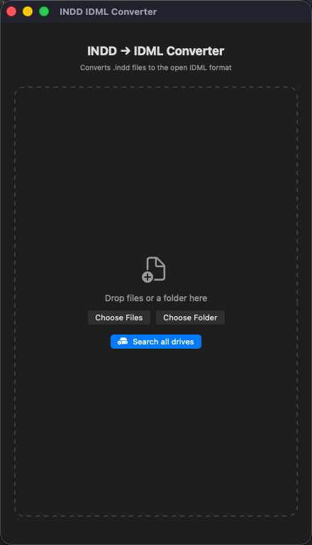
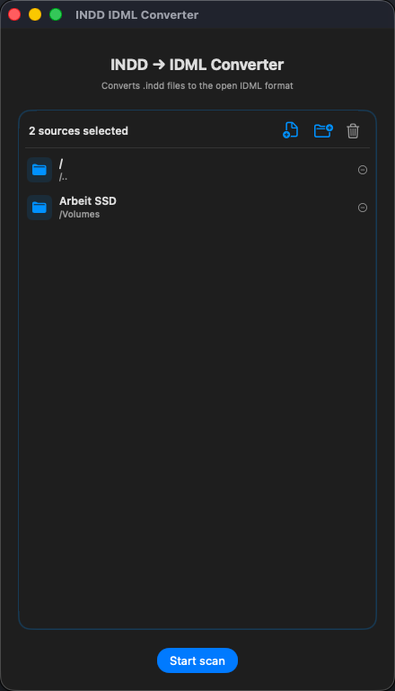
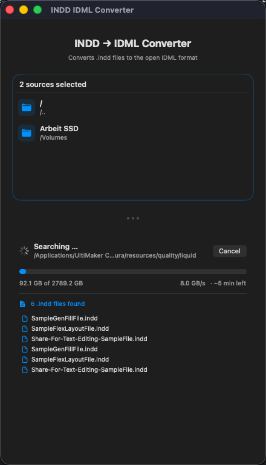

# INDD → IDML Converter

[English](README.md) · **Deutsch**

[](LICENSE)
[](https://ko-fi.com/konradvb)
[](https://github.com/sponsors/konradvb)

Wandelt Adobe-InDesign-Dateien (`.indd`) ins offene **IDML**-Format um — im Stapel, automatisch. Öffne deine Layouts in **Affinity Publisher**, QuarkXPress und anderen Apps, ohne für immer im Adobe-Abo gefangen zu sein.

> **Perfekt für den Moment, bevor du dein Adobe-Abo kündigst.** Zeig der App einen Ordner (oder die ganze Festplatte), und sie speichert jedes InDesign-Dokument als offenes `.idml` direkt neben das Original. Dein Archiv bleibt für immer offenbar.

<p align="center">
  
  
  
</p>

---

## Warum die Dateien überhaupt umwandeln?

`.indd` ist ein **geschlossenes, proprietäres Format**: Nur Adobe InDesign kann es öffnen. Sobald du nicht mehr für Creative Cloud zahlst, werden deine eigenen alten Layouts unlesbar — eingesperrt in einer Datei, die nur Adobe aufschließen kann.

`.idml` ist das **offene** Gegenstück. Es trägt dasselbe Layout (Seiten, Text, Stile, Rahmen) in einem dokumentierten, herstellerneutralen Format, das auch andere Programme lesen können:

- **Affinity Publisher** (Einmalkauf, kein Abo) importiert IDML direkt — der häufigste Umstiegsgrund.
- Es ist deine **Versicherung gegen Lock-in:** Sind die Dateien einmal IDML, kannst du sie auch in zehn Jahren noch öffnen — egal, was mit deinem Adobe-Plan passiert.
- **Du besitzt deine Arbeit wieder** — ein offenes Format heißt, die Dateien gehören dir, nicht einem Abo.

Der Haken: Von Hand bedeutet das, jedes Dokument einzeln in InDesign zu öffnen und *Exportieren* zu klicken — bei einer Datei okay, bei Hunderten eine Qual. **Diese App erledigt den ganzen Stapel automatisch.**

---

## Voraussetzungen

- **macOS 13** (Ventura) oder neuer
- **Adobe InDesign installiert.** Die App steuert InDesign im Hintergrund für den eigentlichen Export — sie ist also ein **Migrations-/Archiv-Werkzeug, kein Adobe-Ersatz.** Du brauchst InDesign auf dem Rechner, *während* du konvertierst; danach kannst du kündigen und behältst die IDML-Dateien.

> **Tipp:** Ein **kostenloses Adobe-Creative-Cloud-Probeabo** (7 Tage) reicht völlig aus, um die gesamte Konvertierung durchzuführen. InDesign über das Probeabo installieren, das ganze Archiv umwandeln, dann kündigen — kein langfristiges Abo nötig.

---

## Herunterladen & Installieren

1. Lade die **[neueste Version hier](https://github.com/konradvb/indd-to-idml-converter/releases/latest)** herunter — ein `.dmg`-Image.
2. Öffne das `.dmg` und **zieh `INDDConverter` auf die Programme-Verknüpfung** im Fenster.
3. **Nur beim ersten Start:** Rechtsklick (bzw. ctrl-Klick) auf die App im Programme-Ordner → **Öffnen** → im Dialog bestätigen.

> Der Rechtsklick ist eine einmalige Sache beim allerersten Start. Danach reicht ein normaler Doppelklick. *(Dieser Schritt entfällt, sobald die App notarisiert ist — siehe [Für Entwickler](#für-entwickler).)*

---

## So geht's — Schritt für Schritt

1. **App öffnen.**
2. **Hinzufügen, was du umwandeln willst.** Drei Wege, beliebig kombinierbar:
   - Dateien oder Ordner direkt **aufs Fenster ziehen**
   - die Knöpfe **Dateien wählen** / **Ordner wählen**
   - **Alle Laufwerke durchsuchen** — findet jede `.indd` auf allem, was gerade angeschlossen ist (ideal fürs komplette Archiv)
3. **Scan starten.** Die App sucht und listet jede gefundene `.indd`. Du siehst die Liste live wachsen und kannst jederzeit **abbrechen.**
4. **Konvertieren starten.** InDesign öffnet sich leise im Hintergrund und exportiert jede Datei als `.idml` — direkt neben das Original.
5. **Fertig.** Du siehst, wie viele Dateien erfolgreich waren, übersprungen wurden oder fehlschlugen. Klick auf einen Eintrag, um ihn im Finder zu zeigen.

**Zwei Dinge für deine Sicherheit:**
- Deine Original-`.indd`-Dateien werden **nie verändert.**
- Dateien, neben denen schon eine `.idml` liegt, werden **übersprungen** — du kannst also jederzeit erneut scannen, ohne doppelte Arbeit.

---

## Gut zu wissen (Grenzen)

| Thema | Was passiert |
|-------|--------------|
| **Fehlende Schriften** | InDesign ersetzt sie beim Export. Affinity Publisher markiert sie gelb, sodass du die richtigen Schriften dort neu zuweisen kannst. |
| **Verknüpfte Bilder** | IDML speichert das *Layout*, nicht die Bilddateien. Liegt ein verknüpftes Bild nicht mehr am Originalpfad, bleibt der Rahmen in Affinity leer und muss neu verknüpft werden. |
| **Cloud-/gesperrte Ordner** | Dateien in gesperrten App-Containern (z. B. manchen iCloud-Containern) können nicht direkt gelesen werden. Erst in einen normalen Ordner verschieben, dann konvertieren. |
| **Dialoge** | Fehlende-Verknüpfungen- und Schriften-Abfragen werden automatisch unterdrückt — der Stapel läuft durch, ohne dass du klicken musst. |

---

## Verwandte Tools

### adobe-fonts-revealer

[**adobe-fonts-revealer**](https://github.com/Kalaschnik/adobe-fonts-revealer) durchsucht deine InDesign-Dateien und zeigt dir alle verwendeten Schriften an — noch vor der Konvertierung.

Damit weißt du genau, welche Schriften in deinen `.indd`-Dateien eingebettet oder verknüpft sind, und kannst sicherstellen, dass du alle benötigten Schriften installiert (oder beschafft) hast, bevor du das fertige `.idml` in Affinity Publisher oder einer anderen App öffnest. Besonders praktisch bei größeren Archiven, wo fehlende Schriften sonst erst nachträglich einzeln als Warnungen auftauchen.

---

## Projekt unterstützen

Dieses Tool ist **gratis und Open Source**. Wenn es dir Stunden Arbeit oder einen Monat Adobe-Abo gespart hat, freue ich mich über eine kleine Unterstützung:

[](https://ko-fi.com/konradvb)
[](https://github.com/sponsors/konradvb)

---

## Für Entwickler

Native macOS-**SwiftUI**-App, Workspace + Swift Package Manager.

```
INDDConverter.xcworkspace          ← in Xcode öffnen
INDDConverter/                     ← App-Shell (Entry Point, Assets, AppIconGlass.icon)
INDDConverterPackage/
  Sources/INDDConverterFeature/
    ContentView.swift              ← UI
    Converter.swift                ← Scan + InDesign-Steuerung (AppleScript via osascript)
    Resources/{de,en}.lproj/       ← lokalisierte Strings
Config/                            ← xcconfig Build-Einstellungen + Entitlements
notarize.sh                        ← bauen, signieren, notarisieren
convert_indd_to_idml.applescript   ← Standalone-Script (ohne App)
find_indd_files.sh                 ← Hilfsskript zum Erstellen einer Dateiliste
```

### Build

```bash
open INDDConverter.xcworkspace
# oder
xcodebuild -workspace INDDConverter.xcworkspace -scheme INDDConverter -configuration Release build
```

### Kommandozeilen-Alternative (ohne App)

```bash
./find_indd_files.sh ~/Documents /tmp/indd_files.txt   # 1. .indd-Pfade sammeln
osascript convert_indd_to_idml.applescript             # 2. konvertieren (Pfade oben im Script anpassen)
```

---

## Lizenz

[MIT](LICENSE)
